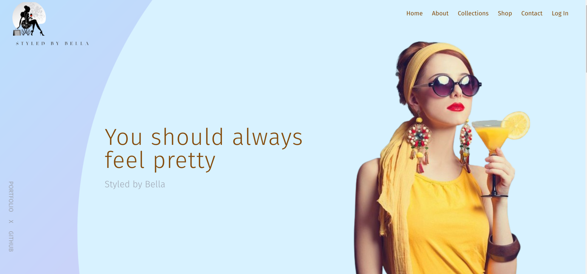

# Styled By Bella
#### *A laravel e-commerce Fashion website*




Welcome to <a href="https://styledbybella.studio/" target="_blank">Styled by Bella</a>, a modern, responsive eCommerce platform built with Laravel, Tailwind CSS and Alpine.js, focusing on fashion retail. My goal is to provide a seamless shopping experience for users looking to purchase fashion items online, with an emphasis on intuitive design, user-friendly navigation, and secure checkout processes.

This project was developed as part of my <a href="https://www.alxafrica.com/" target="_blank">ALX</a> final projcet


## Tech Stack

### Backend
- Laravel Framework
    - Controllers
    - Models
    - Eloquent Relationships
    - Middleware

### Fronted
- Tailwind Css
- Alpine.js
- Blade Templating Engine

### Database
- MySQL
    - Migrations
    - Seeders

### Security
- Authentication and Authorization
- CSRF Protection
- Validation

### Deployment and Operations
- Digital Ocean Ubuntu 22.04 droplet
- Nginx
- Namecheap domain name

### Testing
- PHPUnit

### Development and Version Control
- Git and GitHub
- Docker (via Laravel Sail)


This architecture is designed to be modular and scalable, allowing for parts of the system to be updated or replaced as requirements evolve without major overhauls to the entire application.


## Features
- **User Authentication**: Secure login and registration system powered by Laravel Breeze.
- **Product Catalog**: Dynamic product listings with categories, sizes, and images.
- **Cart Management**: Session-based cart system for adding and removing products.
- **Order Processing**: Simplified checkout process and order history tracking for registered users.
- **Responsive Design**: Fully responsive web design with Tailwind CSS for an optimal shopping experience across all devices.
- **Dynamic Interactions**: Minimal, intuitive interactions with Alpine.js for a smooth frontend experience.


## Getting Started
### Prerequisites
- PHP >=8.2
- Composer
- Docker
- npm or yarn
- MySQL

Installation
1. Clone the repository
```
git clone https://github.com/yourusername/styled_by_bella.git
cd styled-by-bella
```
2. Install PHP dependencies
```
composer install
```
3. Set up your environment file
Copy the .env.example file to a new file named .env, and configure your application and database settings.

```
cp .env.example .env
```
4. Generate an application key
```
php artisan key:generate
```
5. Install JavaScript dependencies and compile assets
```
npm install
npm run dev
# or, if you use yarn
yarn install
yarn dev
```
6. Run database migrations and seeders
```
php artisan migrate --seed
```
7. Serve the application
```
php artisan serve
```
Your application should now be running on http://localhost:8000.

### Contributing
We welcome contributions to Styled by Bella. Please read our contributing guidelines before submitting pull requests to the project.

<h3>Acknowledgments</h3>
<p>
    I want to express my gratitude to the following resources and individuals who greatly 
    contributed to the development of the Styled By Bella project:
</p>

<h4>Resources: </h4>
<p>
    <ol>
        <li><a href="https://laravel.com/docs/10.x/installation" target="_blank">Laravel Documentation</a></li>
        <li><a href="https://www.digitalocean.com/community/tutorials/how-to-install-and-configure-laravel-with-nginx-on-ubuntu-22-04" target="_blank">Digital Ocean Nginx with laravel installation</a></li>
        <li><a href="https://tailwindcss.com/" target="_blank">Tailwind CSS Documentation</a></li>
        <li><a href="https://www.digitalocean.com/community/tutorials/initial-server-setup-with-ubuntu-22-04" target="_blank">Digital Ocean Server setup</a></li>        
        <li>chatGPT</li>
    </ol>
</p>

<h4>Individuals: </h4>
<p>
    <ol>
        <li>My mentor, <a href="https://github.com/muindetuva">Alfred</a>.
            A heartfelt thank you to my mentor for providing guidance, support, and valuable insights throughout the development of Styled By Bella. 
            I would never have found myself in the wonderful world of php, laravel, Tailwind CSS and Alpine.js if it wasn't for you.
        </li>
        <li>
            My friend, <a href="https://github.com/astianmuchui">Sebastian</a>
            who makes the most beautiful websites and inspires me every day to become the best 
            developer. His constructive feedback and collaborative efforts significantly enhanced the quality of the project.
        </li>
        <li>
            My friend and mentor, <a href="https://github.com/Domains18">Gibsons</a>.
            A special thanks for being my personal rubber duck, and for actively participating in discussions, brainstorming sessions, and code reviews.
            And for believing in me even when I didn't.
        </li>
        <li>
            I want to acknowledge the <a href="https://www.alxafrica.com/">ALX</a> community and the wider community of developers and contributors whose open-source projects, discussions, 
            and code snippets served as a source of inspiration and learning.
        </li>
    </ol>
</p>
<p>
    I wouldn't have been able to complete this project without the support of these resources and individuals. 
    Your contributions have been invaluable, and I am grateful for the knowledge, encouragement, 
    and camaraderie that fueled the development of Styled By Bella. Thank you!


